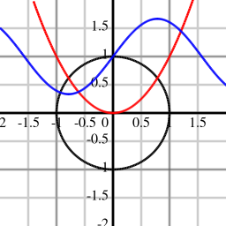

# Hulet

[](https://github.com/quantum9Innovation/hulet/actions/workflows/node.js.yml)

> IPA: /huːlət/*, Amharic: ሁለት, Definition: 'two'

The canvas as the Cartesian plane  
\**'uː' like the 'oo' in 'm**oo**se', 'ə' like the 'a' in '**a**bout'*

---

As of right now, Hulet is still very much in the alpha stage of development.
You can track what needs to be done and what's getting done in [TODOS.md](TODOS.md).
This README will likely be updated as the project progresses to feature the latest developments.

## Building

Install with:

- **Node.js**: `npm install hulet`
- **Web**: <https://cdn.jsdelivr.net/npm/hulet@0.1.2/dist/hulet.min.js> (JSDelivr)
- **Web** (raw*): [dist/hulet.min.js](https://raw.githubusercontent.com/quantum9Innovation/hulet/npm-deploy/dist/hulet.min.js)

\**Always pin to a version in production to avoid unsafe code execution*

**Important note**: Unfortunately, there is no complete documentation for the package as internal structure is still rapidly changing.
This is currently a work in progress, so for now the guide presented [here](#guide) will have to suffice.

### From source

To start, clone the repo and install the required dependencies:

```sh
git clone https://github.com/quantum9innovation/hulet
cd hulet; npm install .
```

### Additional Notes

If you intend to work on a fork, installing the dev dependencies with `npm install --dev` will be quite helpful.
Additionally, if you plan on using Hulet in native Node.js as opposed to in the browser, you'll need to install [`canvas`](https://www.npmjs.com/package/canvas) to create the initial 2D rendering context.

Sost is designed to work both in a native Node.js environment (through the `canvas` module) and in a browser environment (using Browserify and Terser).
To see some examples of Sost running in Node.js, simply run `npm test` from the project root and check [artifacts](./test/artifacts/) for the results.
For a more impressive demo, simply run `npm start`, which will launch [index.html](./index.html) in the browser, and then drag to rotate the view.

## Screenshots

If the tests work, you should see two images like those below appear in the [artifacts](./test/artifacts/) directory.
For an interactive demo, see: <https://quantum9innovation.github.io/hulet/>




*The first test (left) demonstrates Hulet's ability to graph primitive geometric objects in the Cartesian plane. The second (right) demonstrates Hulet's algebraic graphing utilities.*

## Guide

As the majority of time is being spent on development, this guide is quite brief and focused on the core functionality.
More details will be provided when formal documentation is available.

The first thing to do is to generate a 2D canvas.
Hulet will then take this canvas and "transform" it into the Cartesian plane, as we'll see in a moment.
Hulet works with both the `canvas` package in Node.js and an actual HTML5 canvas.

If you're using a browser, you'll need to load the browser-ready version of Hulet from `dist/hulet.min.js`, which is generated by `npm run build`.

Now, create the canvas and get its 2D rendering context to be passed into Hulet:

```js
const canvas = ...
const ctx = canvas.getContext('2d')
```

In Hulet, the canvas initializer is a function that takes a canvas context and two dimensional variables.
It's important to note the distinction between these dimensions and the actual canvas dimensions.
These dimensions tell Hulet how wide and how tall the Cartesian plane it will display should be and are not related to the canvas pixel dimensions.
The origin of the plane will initially be located at the center of the canvas, though this can be changed by using a different perspective.

To create the plane, we need to use the `Cartesian` method and pass in the dimensions of our Cartesian plane's initial viewport in the order of width and then height.
For now, we'll create a 10x10 canvas as shown below:

```js
const two = new hulet.Cartesian(ctx, 10, 10)
```

The four corners of this plane are given by the vertices $ (\pm 5, \pm 5) $, with the center at the origin $ (0, 0) $.
However, in reality, the plane continues on to infinity; these dimensions merely represent the *visible* portion of the Cartesian plane.

We can set an initial perspective for our Cartesian space by accessing the built-in Camera object.
Perspectives are a way of applying a series of transformations to the Cartesian plane.
For example, if we want to center our plane at the point $ (1, 1) $ and zoom in by a factor of $ 2 $, we would use:

```js
two.Camera.center = [1, 1]
two.Camera.zoom *= 2
```

Here, we access the `Camera` object which stores various perspective-related information.
Notice that in setting the `zoom` property, we never use `Camera.zoom = 2`, but instead `Camera.zoom *= 2`.
This is because Hulet precomputes an appropriate zoom factor to map the viewport onto the canvas pixel dimensions.
Thus, to zoom in by a factor of two, we merely zoom in twice as much as we already have.

Sost currently supports four types of geometric objects: points, lines, polygons, and circles.
Points are drawn as a circle centered at the point's coordinates with a radius equal to `three.pointSize` and color `three.pointStyle`.
Lines are drawn between a pair of provided coordinates with thickness `three.lineWidth` and color `three.strokeStyle`.
There are three types of lines: segments, rays, and lines, each corresponding to different geometric definitions.
Polygons are drawn between three or more coordinates with color `three.fillStyle`.
Circles take a center and radius, and also have the same stroke and fill properties.
Stroke/fill modes can be selectively enabled or disabled for closed geometric objects by switching the `three.fill` and `three.stroke` properties.

Let's demo all four of these objects in our scene:

```js
// Lines
two.segment([0, 0], [1, 1])

// Shapes
two.polygon([[-1, -1], [-2, -1], [-2, -2], [-1, -2]])
two.stroke = false; two.fillStyle = '#0af'
two.circle([-3, -3], 1)

// Points
two.point([0, 0])
two.point([1, 1])
```

This should display a segment between two red points near the center of the canvas, a square opposite the segment, and a circle in the bottom right.

Now, we're going to take a more algebraic approach and plot certain functions.
The end result is going to resemble the second screenshot from [above](#screenshots).
First, we're going to initialize a new canvas like before, but now we're going to explore a new set of functions.

First, let's create the outline of our plane; we'll create the axes, gridlines, minor gridlines, and axis labels:

```js
two.grid(1 / 2, '#ccc')
two.grid(1)
two.axes()
two.label(1 / 2, '16px times')
```

The first argument of `grid` and `label` is the spacing between gridlines.
After that, various styling properties can be passed in as well.

Now that we have the axes and gridlines, we can plot some functions.
We'll begin with parametric equations.
Let's plot the unit circle parameterized by the equation $ (\cos t, \sin t) $:

```js
const f = t => [Math.cos(t), Math.sin(t)]
const T = [0, 2 * Math.PI]
two.parametric(f, T)
```

The first argument of `parametric` is a function that takes a parameter and returns a 2D coordinate.
The second argument is an array of two numbers, the starting and ending parameter values, which define the "domain" of the input space.

Next, we'll graph two functions in different colors.
To do this, we simply need to call the `graph` method (we can also specify a domain and range, but Hulet will automatically figure this out in the absence of either):

```js
const g = x => x ** 2
two.strokeStyle = '#f00'
two.graph(g)

const h = x => Math.sin(2 * x) * 2 / 3 + 1
two.strokeStyle = '#00f'
two.graph(h)
```

There you have it!
Running the code should produce the example screenshot.

## Future Work

Hulet is very much still a work in progress and there is lots to be done.
If you want to help out, it is highly recommended that you fork the repository and view the [TODOS](./TODOS.md) as well as any open issues for work that you can help with.
